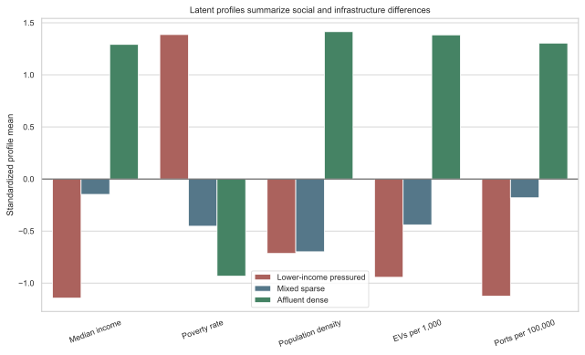
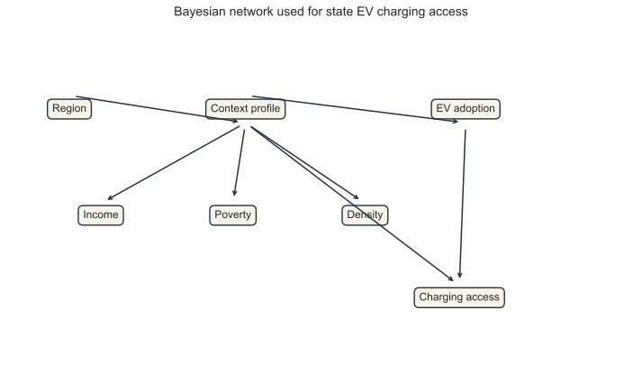
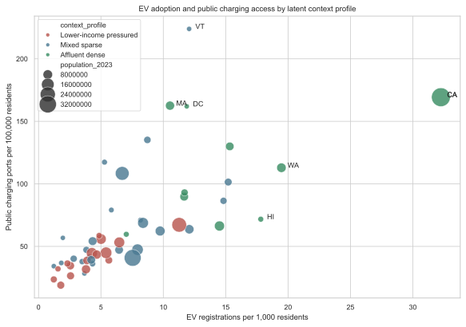
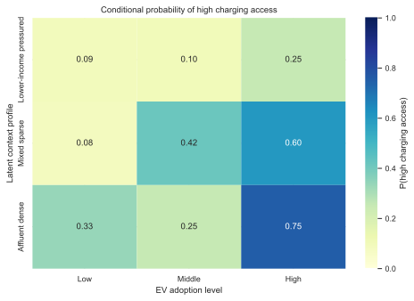

## Introduction

Electric vehicles are often discussed as a transportation technology, but EV adoption is also a social and geographic process. A household's ability to consider an EV depends partly on whether charging infrastructure is nearby, reliable, and visible. At the same time, charging infrastructure is not placed evenly across communities. It tends to follow markets with higher EV adoption, denser travel demand, higher income, and stronger policy support. This creates a social phenomenon that is well suited to probabilistic graphical modeling because several observed factors move together, and no single explanation is likely to capture the whole pattern.

The research question for this project is:

> How do statewide social context, population density, and EV adoption relate probabilistically to public EV charging access?

I treat this as a Path 1 project because the goal is not to estimate a causal effect of one policy or treatment. Instead, the goal is to model the joint structure of a social phenomenon. I use a latent variable model to identify unobserved state context profiles and then use a Bayesian network to represent how those profiles are associated with income, poverty, density, EV adoption, and charging access. This follows the spirit of the path example, where a latent persona model is used to infer hidden character types from observed text and metadata. Here, the hidden type is a state infrastructure context rather than a film persona.

The project makes three contributions. First, it assembles a reproducible statewide dataset from public federal sources. Second, it learns three interpretable latent profiles: lower income pressured states, mixed sparse states, and affluent dense states. Third, it estimates and evaluates a Bayesian network that predicts public charging access from latent context and EV adoption.

## Data

The unit of analysis is the U.S. state, including the District of Columbia. The final analytic dataset contains 51 observations. I use the following data sources:

| Source | Variables used |
|---|---|
| U.S. Department of Energy Alternative Fuels Data Center, Electric Vehicle Charging Ports by State | Public charging ports, private charging ports, total charging ports |
| U.S. Department of Energy Alternative Fuels Data Center, Electric Vehicle Registrations by State | 2023 passenger EV registration counts |
| U.S. Census Bureau Population Estimates Program | 2023 resident population and Census region |
| U.S. Census Bureau Small Area Income and Poverty Estimates | 2023 median household income and poverty rate for all ages |
| U.S. Census Bureau TIGERweb state boundary table | Land area, used to calculate population density |

The raw files are saved under `data/raw/`, and the processed modeling file is saved as `data/processed/state_model_data.csv`. The script `scripts/build_analysis.py` reproduces the cleaning, modeling, evaluation, and figure generation.

### Feature Engineering

I standardize infrastructure and adoption counts by population:

$$
\text{Public charging access}_i =
\frac{\text{public charging ports}_i}{\text{population}_i} \times 100,000
$$

$$
\text{EV adoption}_i =
\frac{\text{EV registrations}_i}{\text{population}_i} \times 1,000
$$

Population density is calculated as 2023 population divided by land area in square miles. Since density is highly skewed, the latent profile model uses log population density. For the Bayesian network, continuous variables are discretized into tertiles labeled `Low`, `Middle`, and `High`. This keeps the conditional probability tables interpretable and avoids overfitting a 51-observation dataset with overly granular states.

The median state in the dataset has 54.21 public charging ports per 100,000 residents and 5.63 EV registrations per 1,000 residents. These medians hide large differences: Vermont, California, Massachusetts, and the District of Columbia have especially high public port density, while several states with lower EV adoption have sparse public charging access.

## Latent Context Profiles

To represent unobserved state context, I estimate a Gaussian mixture model with three components using standardized median household income, poverty rate, and log population density. In notation:

$$
z_i \sim \text{Categorical}(\pi)
$$

$$
x_i \mid z_i = k \sim \mathcal{N}(\mu_k, \Sigma_k)
$$

where $z_i$ is the latent context profile for state $i$ and $x_i$ is the vector of social and geographic features. A model with three components has the lowest BIC among the tested values $K \in \{2,3,4,5\}$.

| Number of profiles | BIC |
|---:|---:|
| 2 | 408.58 |
| 3 | 400.71 |
| 4 | 415.12 |
| 5 | 429.46 |

The three profiles are substantively interpretable:

| Latent context profile | States | Median income | Poverty rate | Density | EVs per 1,000 | Public ports per 100,000 |
|---|---:|---:|---:|---:|---:|---:|
| Lower income pressured | 16 | $64,691 | 14.83% | 158.5 | 4.21 | 40.58 |
| Mixed sparse | 25 | $77,997 | 11.26% | 168.5 | 6.59 | 68.23 |
| Affluent dense | 10 | $97,227 | 10.33% | 1,475.1 | 15.22 | 111.74 |

{#fig-profile-summary width="85%"}

The latent profiles are not labels observed in the original data. They are inferred groupings that summarize recurring state contexts. The mean maximum assignment probability is 0.959, suggesting that the three profiles are well separated in the fitted mixture model.

## Bayesian Network

The main probabilistic graphical model is a Bayesian network with seven discrete variables:

| Symbol | Variable | States |
|---|---|---|
| $R$ | Census region | Northeast, Midwest, South, West |
| $Z$ | Latent context profile | Lower income pressured, mixed sparse, affluent dense |
| $I$ | Median income level | Low, Middle, High |
| $Q$ | Poverty level | Low, Middle, High |
| $D$ | Population density level | Low, Middle, High |
| $E$ | EV adoption level | Low, Middle, High |
| $C$ | Public charging access level | Low, Middle, High |

The model factorizes as:

$$
P(R,Z,I,Q,D,E,C)
= P(R)P(Z \mid R)P(I \mid Z)P(Q \mid Z)P(D \mid Z)P(E \mid Z)P(C \mid Z,E)
$$

This structure encodes the idea that region is a broad contextual prior, the latent profile summarizes social and geographic context, and public charging access depends most directly on both latent context and EV adoption.

{#fig-dag width="80%"}

Each conditional probability table is estimated with Dirichlet smoothing:

$$
\hat{P}(X=x \mid Pa(X)=a) =
\frac{n(x,a)+\alpha}{n(a)+\alpha |\mathcal{X}|}
$$

where $\alpha=1$. Smoothing is important here because the dataset is small and some combinations of profile and adoption level are rare.

## Results

### Exploratory Associations

Public charging access is most strongly associated with EV adoption. The Spearman correlation between EV registrations per 1,000 residents and public charging ports per 100,000 residents is 0.852. Median household income is also strongly positive, while poverty is negative.

| Relationship with public ports per 100,000 residents | Spearman rho | p value |
|---|---:|---:|
| Median household income | 0.698 | < 0.001 |
| Poverty rate | -0.380 | 0.006 |
| Population density | 0.390 | 0.005 |
| EV registrations per 1,000 residents | 0.852 | < 0.001 |

{#fig-ev-ports width="85%"}

The scatterplot shows a clear upward pattern: states with more EV registrations per resident tend to have more public charging ports per resident. The affluent dense profile appears in the part of the plot with more adoption and more infrastructure, while lower income pressured states mostly sit in the part with lower adoption and less access.

### Conditional Probabilities

The fitted Bayesian network estimates a large difference in high charging access by EV adoption level:

| Query | Estimated probability |
|---|---:|
| $P(C=\text{High} \mid E=\text{High})$ | 0.641 |
| $P(C=\text{High} \mid E=\text{Low})$ | 0.100 |
| $P(C=\text{High} \mid Z=\text{Affluent dense}, E=\text{High})$ | 0.750 |
| $P(C=\text{High} \mid Z=\text{Lower income pressured}, E=\text{Low})$ | 0.091 |

{#fig-cpt width="70%"}

The conditional probability table suggests that adoption and context compound each other. High EV adoption is associated with high charging access in both mixed sparse and affluent dense profiles, but the highest estimated probability occurs when high adoption appears inside the affluent dense profile. In contrast, states with low adoption in the lower income pressured profile have very low probability of high public charging access.

### Predictive Evaluation

I evaluate the network using leave one out prediction of the discretized charging access level. For each held out state, the conditional probability tables are estimated again from the remaining states. The model then predicts the charging access level using the held out state's context profile and EV adoption level.

| Metric | Value |
|---|---:|
| Leave one out accuracy | 64.7% |
| Chance baseline accuracy | 33.3% |
| Leave one out log loss | 0.753 |
| Marginal baseline log loss | 1.128 |

The model is not large, but it predicts substantially better than chance. The log loss improvement also matters because it evaluates probability calibration rather than only the most likely class.

## Discussion

The model supports three main findings.

First, charging access is not randomly distributed across states. It is tied to a broader state context that includes income, poverty, and density. The latent profiles show that states with higher income and density also tend to have higher EV adoption and charging access.

Second, EV adoption is the strongest observed correlate of public charging access. This may reflect infrastructure following demand, demand following infrastructure, or both. The current model should therefore be interpreted as associational. It does not identify the causal effect of charging ports on EV adoption or the causal effect of EV adoption on infrastructure deployment.

Third, probabilistic graphical models help make the structure explicit. A standard regression could estimate a single coefficient for income or EV adoption, but the Bayesian network gives conditional probability statements such as $P(C=\text{High} \mid Z,E)$. These statements are easy to compare across profiles and can be updated if future data include additional variables.

There are several limitations. The analysis is statewide, so it cannot capture inequality inside a state, such as differences between urban and rural communities or between neighborhoods. Public ports are measured as counts, not reliability, speed, price, or uptime. The latent profile is estimated from observed social and geographic variables, so it should be understood as an interpretable summary rather than a directly measured social category. Finally, because all variables are measured in roughly the same period, the model does not establish temporal ordering.

## Conclusion

This project demonstrates how Path 1 probabilistic graphical modeling can be used to study a real social infrastructure problem. By combining a latent profile model with a Bayesian network, the analysis shows that public EV charging access varies systematically with state context and EV adoption. The strongest pattern is that high EV adoption states are much more likely to have high public charging access, especially when they belong to the affluent dense latent profile. A useful next step would be to move from states to counties or census tracts, add policy incentives and charger speed, and model changes over time.

## Reproducibility

To reproduce the analysis, run:

```bash
/Users/fanlanbin/miniforge3-codex/bin/python scripts/build_analysis.py
```

The command regenerates:

| Output | Description |
|---|---|
| `data/processed/state_model_data.csv` | Final analytic dataset |
| `data/processed/model_cpts.json` | Estimated Bayesian network CPTs |
| `data/processed/loo_predictions.csv` | Leave one out predictions |
| `images/pgm_dag.svg` | Bayesian network diagram |
| `images/profile_summary.svg` | Latent profile summary figure |
| `images/ev_vs_ports.svg` | EV adoption and charging access scatterplot |
| `images/charging_cpt_heatmap.svg` | Conditional probability heatmap |

## References {.unnumbered}

Alternative Fuels Data Center. "Electric Vehicle Charging Ports by State." U.S. Department of Energy. https://afdc.energy.gov/data/10366.

Alternative Fuels Data Center. "Electric Vehicle Registrations by State." U.S. Department of Energy. https://afdc.energy.gov/data/10962.

Dempster, Arthur P., Nan M. Laird, and Donald B. Rubin. 1977. "Maximum Likelihood from Incomplete Data via the EM Algorithm." *Journal of the Royal Statistical Society: Series B* 39 (1): 1-38.

Koller, Daphne, and Nir Friedman. 2009. *Probabilistic Graphical Models: Principles and Techniques*. MIT Press.

Pearl, Judea. 1988. *Probabilistic Reasoning in Intelligent Systems: Networks of Plausible Inference*. Morgan Kaufmann.

U.S. Census Bureau. "Annual Estimates of the Resident Population for the United States, Regions, States, District of Columbia, and Puerto Rico: April 1, 2020 to July 1, 2023." Population Estimates Program. https://www2.census.gov/programs-surveys/popest/datasets/2020-2023/state/totals/NST-EST2023-ALLDATA.csv.

U.S. Census Bureau. "SAIPE State and County Estimates for 2023." Small Area Income and Poverty Estimates Program. https://www.census.gov/data/datasets/2023/demo/saipe/2023-state-and-county.html.

U.S. Census Bureau. "U.S. States, ACS23, Data as of January 1, 2023." TIGERweb. https://tigerweb.geo.census.gov/tigerwebmain/Files/bas25/tigerweb_bas25_state_2023_acs23_us.html.
